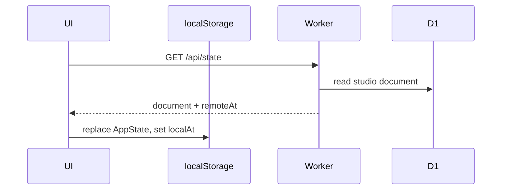
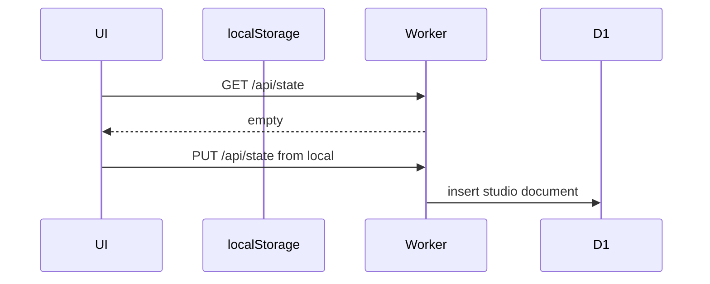
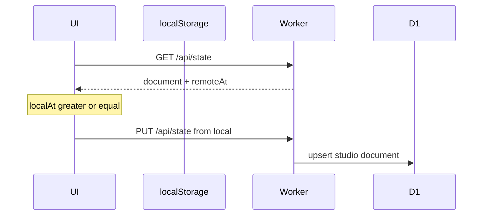
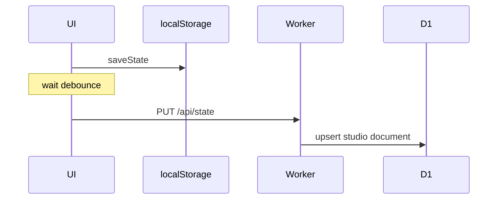

# Data model & persistence design

**Status:** Implemented (local + D1 document sync).  
**Related:** [infra-design-exploration.md](./infra-design-exploration.md) (hosting/auth stack).

## Principles

- **Application storage only** — persist what the product needs to run (identity + the user’s studio document). Not a warehouse: no server-side analytics, reporting SQL, or cross-user queries as a design goal.
- **One document in the UI** — the SPA’s `AppState` remains the working model; cloud sync mirrors that document.
- **$0 budget** — stay inside Cloudflare free allowances; avoid storage products that introduce a path to billed usage for solo hobby traffic.
- **Don’t put rebuildable or bulky device media in D1** — sheet CSV cache and audio bytes stay out of the synced document.

Canonical `AppState` fields live in code (`[src/lib/types.ts](../src/lib/types.ts)`); load/migrate in `[src/lib/storage.ts](../src/lib/storage.ts)`. This doc does **not** snapshot the JSON shape (it churns with the app).

## Where data lives

```text
Browser
├── localStorage  studio:v1              → AppState document (always)
├── localStorage  studio:sync-updated-at → sync clock
├── sessionStorage studio:google-id-token → app auth (not synced)
├── IndexedDB     studio-audio           → recording bytes
└── IndexedDB     studio-sheet-csv       → sheet CSV cache

Cloudflare D1 (one shared DB)
├── users       → account / identity row (who signed in)
└── user_state  → studio document row (synced AppState JSON)
```


| Data                                                                  | Store                          | In D1 sync?                         |
| --------------------------------------------------------------------- | ------------------------------ | ----------------------------------- |
| Studio document (`AppState`: stories, sessions, goals, sheet URLs, …) | localStorage + D1 document row | Yes                                 |
| Sign-in identity (Google `sub`, email, …)                             | D1 identity row                | Written by Worker on auth           |
| Interview audio bytes                                                 | IndexedDB                      | No                                  |
| `audioId` on a session answer                                         | Inside `AppState` document     | Yes (string only — see Audio below) |
| Sheet CSV cache                                                       | IndexedDB                      | No (URLs sync; CSV is rebuildable)  |
| Sheets access token / app ID token                                    | Memory / sessionStorage        | No                                  |


## D1: identity row vs studio document

Two tables because they answer different questions. Names in SQL are `users` and `user_state` (historical); think of them as:


| Concept                | Table today  | Purpose                                                                                                  |
| ---------------------- | ------------ | -------------------------------------------------------------------------------------------------------- |
| **Account / identity** | `users`      | “Who is this Google subject?” Profile fields from the ID token. Touched on every authenticated API call. |
| **Studio document**    | `user_state` | “What is their Career Studio data?” One JSON document + `updated_at`. Touched by sync GET/PUT.           |


- Identity without a document → signed in, never synced (or empty cloud).  
- Document always points at an identity (`user_id` FK).  
- We do **not** mean “user state” as session/UI chrome — it is the **persisted app document**.

Migrations: `[0001_users.sql](../migrations/0001_users.sql)`, `[0002_user_state.sql](../migrations/0002_user_state.sql)`.

API (`[worker/index.ts](../worker/index.ts)`):

- `GET|POST /api/me` — verify Google ID token; upsert **identity** row  
- `GET /api/state` — read **studio document**  
- `PUT /api/state` — replace **studio document** (soft max ~2.5MB JSON)

Auth: `Authorization: Bearer <Google ID token>`.

## Sync protocol

`[src/lib/cloudSync.ts](../src/lib/cloudSync.ts)` + `[src/state/Store.tsx](../src/state/Store.tsx)`.

Conflict rule for every cloud write path: **last-write-wins** on ISO `updatedAt` (no field-level merge).

### Case A — Signed out (after welcome)

No cloud I/O. `AppState` loads and saves only via localStorage (`studio:v1`).

**First visit** (no `studio:welcome-done` flag): redirect to **`/login`** (welcome gate) for Sign in with Google or Continue without signing in. Choosing either sets `studio:welcome-done` and navigates into the app. Prior studio data in `studio:v1` is kept; the gate only records an explicit choice.

After **Case D** sign-out, `studio:welcome-done` is cleared and the app returns to **`/login`**.

### Case B — Reconcile on sign-in (or load while already signed in)

Runs once when a Google ID token becomes available: fresh **Sign in**, or **app load** with a token still in `sessionStorage`. Always starts with `GET /api/state`, then one of the subcases below.

Shared inputs: local `AppState`, local sync clock `studio:sync-updated-at` (`localAt`), remote document + `updatedAt` (`remoteAt`).

#### B1 — Cloud document is newer (or local has no sync clock)

**When:** remote has a document and `remoteAt`, and (`localAt` is missing **or** `remoteAt > localAt`).

Typical after **Case D** (sign-out clears `localAt`), so the next sign-in restores the cloud copy.

**Do:** hydrate store from remote; set local sync clock to `remoteAt`; **do not** immediately re-push that hydrate.



#### B2 — Cloud has no document yet

**When:** `GET /api/state` returns empty (`state: null`).

**Do:** `PUT` current local document (may be empty defaults or guest edits from before this sign-in); set sync clock from the save.



#### B3 — Local is same age or newer than cloud

**When:** remote exists, `localAt` is set, and `localAt >= remoteAt`.

**Do:** `PUT` local document over cloud (last-write-wins); update sync clock.



#### B4 — Local has changes not yet on the cloud

**When:** the user edited on this device, but those edits never completed a successful `PUT` (debounce still pending, offline, tab closed, API error), **or** they built local data before the first successful sync. The studio document in localStorage is ahead of D1; until the clock is updated, a naive “cloud newer” check can be wrong.

**Do:** treat local as authoritative when the local sync clock is **≥** remote (`B3` push), or when cloud is empty (`B2`). After each local edit we advance `studio:sync-updated-at` immediately (not only after a successful PUT) so a reload/sign-in reconcile does not hydrate over unpushed work.

**Still last-write-wins:** if another device already wrote a **newer** `remoteAt` than this device’s clock, **B1** applies and local unpushed work is discarded. No merge UI yet.

#### B5 — Reconcile request fails

**When:** network / auth / server error on GET or PUT.

**Do:** keep current local `AppState`; surface sync error in Account UI. No silent wipe.


### Case C — Signed in, user edits the app

Each store change:

1. Save `AppState` to localStorage immediately.
2. **Debounce** (~1.2s), then `PUT /api/state` with bumped `updatedAt`.




### Case D — Sign out

Users expect the app to **stop showing their data** after sign-out (shared device / privacy).

1. Cancel pending cloud pushes — **do not** `PUT` an empty document (that would wipe D1).  
2. Clear local sync clock (`studio:sync-updated-at`).  
3. Replace in-memory + localStorage `AppState` with a fresh empty document (defaults only).  
4. Best-effort clear IndexedDB audio + sheet CSV caches.  
5. Clear `studio:welcome-done` and send the user to **`/login`**.  
6. **Cloud studio document on D1 is kept** so the next Google sign-in can restore via **B1** (no local sync clock → treat cloud as newer).

Signed-out use after “continue anonymously” is a blank guest workspace. Don’t rely on preserving guest edits across sign-out → Google sign-in when a cloud document already exists (**B1** wins).

## Why one JSON document (not normalized tables)

The product already is one document in the browser; cloud storage mirrors that for **application** restore/sync—not for analytics.


|              | Single document       | Normalized tables      |
| ------------ | --------------------- | ---------------------- |
| Fit to SPA   | Same as `studio:v1`   | Mapping layer          |
| API          | GET/PUT state         | Many CRUD routes       |
| Atomicity    | Whole snapshot        | Multi-row coordination |
| Solo app use | Enough                | Extra complexity       |
| Multi-device | Last-write-wins only  | Finer merge possible   |
| Write cost   | Amplification (below) | Small updates          |


**Write amplification:** changing one goal re-serializes and replaces the **entire** document in D1. Acceptable for solo use with debounce and modest document size; revisit if history grows huge or conflicts hurt.

Schema evolution stays in client `normalizeState` (applied to both local and remote JSON).

## Sheet CSV cache

Fetched CSV for trackers lives in IndexedDB because it is **derived** from sheet URLs + Sheets auth, can go stale, and isn’t needed as source of truth. Synced document keeps **URLs** (and light metadata) only.

## Audio and R2 (deferred)

### Why `audioId` exists at all

Playback on **this device** needs a pointer from a session answer → the IndexedDB blob (`studio-audio`). That pointer is `audioId` inside `AppState`. Without it, localStorage would forget which recording belongs to which answer even though the bytes are still in IndexedDB.

It is **not** a claim that audio syncs. Because we sync the whole document, `audioId` rides along to D1 and to other devices as a **dangling reference** there (no blob). Harmless but useless cross-device until object storage exists. Optional later cleanup: strip `audioId` on cloud PUT, or replace with a cloud object key if R2 (or similar) is adopted under a $0-safe plan.

### Bytes and R2

**Current:** audio bytes in IndexedDB only. Cross-device playback is out of scope.

**Cloudflare R2** (object storage) is the usual place *if* we ever sync recordings. Cost stance for this project:

- R2 **egress** (download to the internet) is free.  
- You still pay (above free allowance) for **storage** and **operations** — uploads/writes are Class A ops; stored GB-month accrues. There isn’t a separate “ingress bandwidth” line item; the billable parts of “putting data in” are **write ops + storage**.  
- Free tier exists (~10 GB + op allowances), but **hard requirement is $0**. Adopting R2 adds a real path to non-zero spend (and more moving parts).

So we **do not** use R2 unless a later decision accepts that risk and proves usage stays inside free limits. Prefer IndexedDB until then.

## Explicit non-goals (for now)

- Building a warehouse or analytics product on D1  
- Per-field multi-device merge / CRDTs  
- Syncing audio bytes or sheet CSV  
- Per-user databases or Workers

## When to change this design

1. Multi-device edits need merge, not overwrite
2. Document size / write amplification hurts UX or free-tier writes
3. Product needs partial sync (“only stories”)
4. You need **server-side SQL reporting** (e.g. “minutes practiced per week” without loading the whole document) — then normalize or add extracted tables; today we intentionally don’t
5. Cross-device audio is required **and** a $0-safe storage plan is agreed

Until then, **identity row + one studio document per account** remains the intentional design.